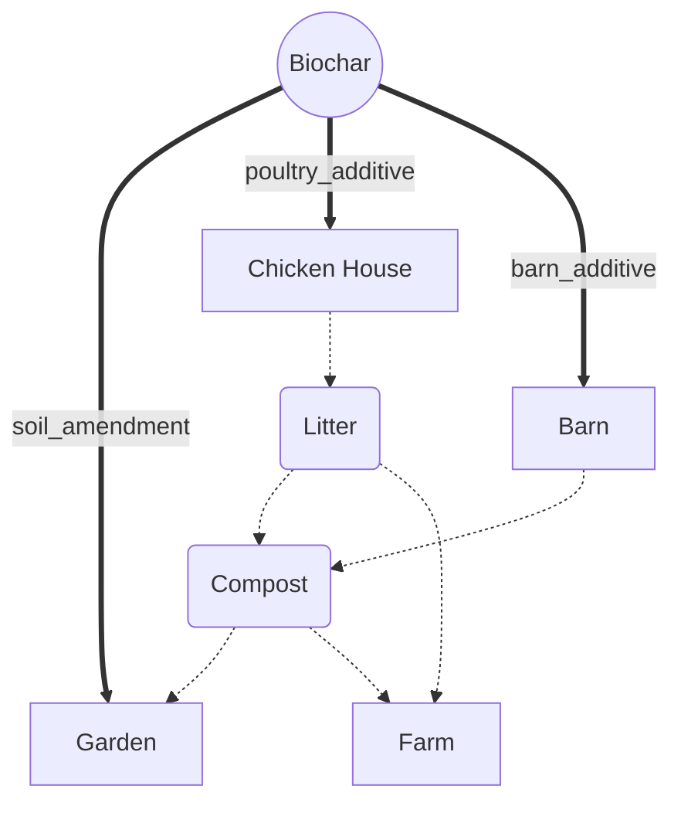

## Welcome to Biochar Hub
### created, curated and composed by Tejas Buds LLC

This is the home of Tejas Buds' Biochar research and articles. There are many uses of biochar, which you can read on this site. Below is a cartoon rendering of some of them highlighted in articles and pages. Please use the contact section to reach out if you have questions, comments or want to contribute.

